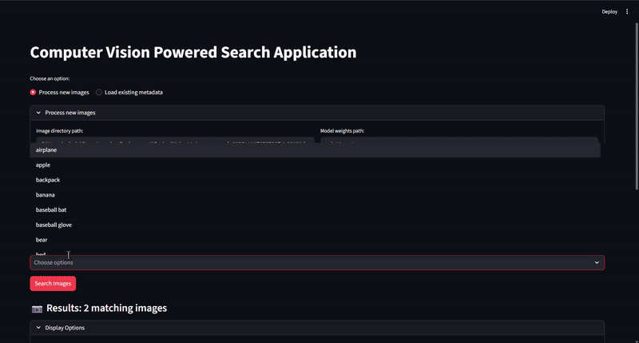

# YOLO11 Image Classification

A YOLO11-based image classification system with an interactive Streamlit web interface for real-time object detection.

## 🎯 What It Does

This project implements YOLO11 for multi-object detection and classification. Users upload images through a Streamlit web app, and the model identifies objects with bounding boxes and confidence scores in real-time.

## 📁 Project Structure
```
├── coco-val-2017-500/     # Validation dataset (500 images)
├── src/                   # Source code
├── app.py                # Streamlit application
├── yolo11m.pt           # Pre-trained YOLO11 medium model
└── requirements.txt
```

## 🌐 Streamlit Application

**Launch:** `streamlit run app.py`

### Interferene


---

## 📹 Demo



---

## 📊 Performance

- **Accuracy:** High precision across 80+ COCO object classes
- **Speed:** Real-time inference with fast processing
- **Model:** YOLO11 Medium pre-trained on COCO dataset

---

## 🛠️ Technologies

- YOLO11 (Ultralytics)
- Streamlit
- PyTorch
- COCO Dataset

---

**Model:** `yolo11m.pt` | **Dataset:** COCO-val-2017-500
